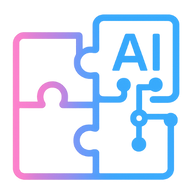

# SynApps v0.4.0

A web-based visual platform for modular AI agents with database persistence and improved workflow execution.

## Introduction

SynApps is a **web-based visual platform for modular AI agents called Snaplets**. Its mission is to let indie creators build autonomous AI snaplets like LEGO blocks – each snaplet is a small agent with a specialized skill (e.g. *Writer*, *Memory*, *Artist*). 

A lightweight **SynApps Orchestrator** routes messages between these snaplets, sequencing their interactions to solve tasks collaboratively. In other words, SynApps connects AI "synapses" (snaplets) in real time, forming an intelligent network that can tackle complex workflows.

## Demo


## Features

- **One-Click Creation & Extreme Simplicity:** Create an AI workflow with minimal steps (one or two clicks).
- **Autonomous & Collaborative Snaplets:** Each snaplet runs autonomously but can pass data to others via the orchestrator.
- **Real-Time Visual Feedback:** See the AI snaplets at work with an animated graph of nodes (snaplets) and connections (data flow).
- **Background Execution & Notifications:** Snaplets run in the background once triggered, with a notification system to alert users of important status changes.
- **Openness and Extensibility:** Support for user-editable snaplets via code for those who want to customize logic.

## Quick Start

### Prerequisites

- [Docker](https://docs.docker.com/get-docker/) and [Docker Compose](https://docs.docker.com/compose/install/)
- Optionally: Node.js 16+ and Python 3.9+ for local development

### Running with Docker

1. Clone the repository:
   ```bash
   git clone https://github.com/nxtg-ai/SynApps-v0.4.0.git
   cd SynApps-v0.4.0
   ```

2. Create a `.env` file in the root of the project with your API keys and database URL:
   ```
   OPENAI_API_KEY=your_openai_api_key
   STABILITY_API_KEY=your_stability_api_key
   DATABASE_URL=sqlite+aiosqlite:///synapps.db
   ```

3. Build and run the containers:
   ```bash
   docker-compose -f infra/docker/docker-compose.yml up --build
   ```

4. Open your browser and navigate to [http://localhost:3000](http://localhost:3000)

### Local Development

#### Backend (Orchestrator)

1. Navigate to the orchestrator directory:
   ```bash
   cd apps/orchestrator
   ```

2. Create a virtual environment and install dependencies:
   ```bash
   python -m venv venv
   source venv/bin/activate  # On Windows: venv\Scripts\activate
   pip install -r requirements.txt
   ```

   Alternatively, you can install the orchestrator as a development package:
   ```bash
   python -m venv venv
   source venv/bin/activate  # On Windows: venv\Scripts\activate
   pip install -e .  # Installs the package in editable mode with all dependencies
   ```

3. Initialize the database:
   ```bash
   alembic upgrade head
   ```

4. Run the development server:
   ```bash
   uvicorn main:app --reload
   ```

#### Frontend

1. Navigate to the frontend directory:
   ```bash
   cd apps/web-frontend
   ```

2. Install dependencies:
   ```bash
   npm install
   ```

3. Run the development server:
   ```bash
   npm start
   ```

## Architecture

SynApps follows a microkernel architecture:

- **Orchestrator:** A lightweight message routing core that passes data between applets and manages workflow execution.
- **Applets:** Self-contained AI micro-agents implementing a standard interface to perform specialized tasks.
- **Frontend:** React app with a visual workflow editor, built on React Flow and anime.js for animations.
- **Database:** SQLite with async SQLAlchemy ORM for persistent storage of workflows and execution state.

## Applets

The MVP includes three core applets:

- **WriterApplet:** Generates text given a topic or prompt using gpt-4o.
- **MemoryApplet:** Stores or retrieves information to maintain context between steps using a vector store.
- **ArtistApplet:** Creates an image from a text description using Stable Diffusion.

## Deployment

The application is configured for deployment to:

- **Frontend:** Vercel
- **Backend:** Fly.io

CI/CD pipelines are set up using GitHub Actions.

## Database

SynApps v0.4.0 uses SQLAlchemy with async support for database operations:

- **ORM Models:** SQLAlchemy models for flows, nodes, edges, and workflow runs
- **Migrations:** Alembic for database schema migrations
- **Repository Pattern:** Clean separation of database access logic
- **Async Support:** Full async/await pattern for database operations

## Development Setup

### Backend (Orchestrator)

1. Navigate to the orchestrator directory:
   ```bash
   cd apps/orchestrator
   ```

2. Install the package in development mode:
   ```bash
   pip install -e .
   ```
   This will install the orchestrator as an editable package, allowing you to make changes to the code without reinstalling.

3. Create a `.env` file in the orchestrator directory with your API keys:
   ```
   OPENAI_API_KEY=your_openai_api_key
   STABILITY_API_KEY=your_stability_api_key
   DATABASE_URL=sqlite+aiosqlite:///synapps.db
   FRONTEND_URL=http://localhost:3000
   ```

4. Run database migrations:
   ```bash
   alembic upgrade head
   ```

5. Start the backend server:
   ```bash
   uvicorn main:app --reload --port 8000
   ```

### Frontend

1. Navigate to the web-frontend directory:
   ```bash
   cd apps/web-frontend
   ```

2. Install dependencies:
   ```bash
   npm install
   ```

3. Create a `.env` file in the web-frontend directory:
   ```
   REACT_APP_API_URL=http://localhost:8000
   REACT_APP_WEBSOCKET_URL=ws://localhost:8000/ws
   ```

4. Start the development server:
   ```bash
   npm start
   ```

## Development Workflow

1. Create a feature branch from `main`
2. Make your changes
3. Write tests for your changes
4. Submit a pull request to `main`
5. After review and approval, the changes will be merged and deployed automatically

## Testing

### Backend Tests

Backend tests use pytest and are located in the `apps/orchestrator/tests/` directory.

```bash
cd apps/orchestrator
source venv/bin/activate  # On Windows: venv\Scripts\activate
pytest -v
```

For more details on testing, see the [CONTRIBUTING.md](CONTRIBUTING.md) file.

### Frontend Tests

Frontend tests use Jest and React Testing Library and are located alongside the components they test.

```bash
cd apps/web-frontend
npm test
```

## Development Scripts

For convenience, a development script is provided to start both the backend and frontend servers:

```bash
.scripts/start-dev.sh
```

This script will:
1. Kill any existing processes on ports 8000 and 3000
2. Start the backend server with hot-reloading
3. Start the frontend development server

## Contributing

Contributions are welcome! Please feel free to submit a Pull Request. See [CONTRIBUTING.md](CONTRIBUTING.md) for detailed guidelines.

1. Fork the repository
2. Create your feature branch (`git checkout -b feature/amazing-feature`)
3. Commit your changes (`git commit -m 'Add some amazing feature'`)
4. Push to the branch (`git push origin feature/amazing-feature`)
5. Open a Pull Request

## License

This project is licensed under the MIT License - see the LICENSE file for details.

## Acknowledgements

- [React Flow](https://reactflow.dev/) for the workflow visualization
- [anime.js](https://animejs.com/) for animations
- [FastAPI](https://fastapi.tiangolo.com/) for the backend
- [Monaco Editor](https://microsoft.github.io/monaco-editor/) for the code editor
